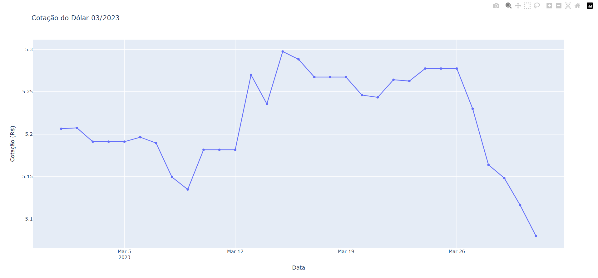
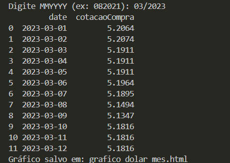

# Introdução

Esta atividade faz parte do Trabalho Individual da disciplina de Algoritmos.  
O objetivo é desenvolver uma rotina que receba um parâmetro no formato **"MMYYYY"** e retorne um **gráfico de linha** com a variação da cotação do dólar no período informado.

Para isso foi utilizada a API **PTAX – Cotação do Dólar por Período**, disponibilizada pelo Banco Central do Brasil:

🔗 https://olinda.bcb.gov.br/olinda/servico/PTAX/versao/v1/swagger-ui3#/

Cada aluno recebeu um mês e ano específicos.  
Minha função transforma o valor recebido (ex.: `"102023"`) em:

- **Data inicial:** primeiro dia do mês  
- **Data final:** último dia do mês  

As datas são calculadas utilizando `datetime` e `calendar`.

Além disso, a API não fornece cotação em **finais de semana** ou **feriados**.  
Nestes casos, foi utilizada a cotação do **dia útil anterior**, conforme instrução da atividade.

---

# Construção da função

A função criada realiza os seguintes passos:

1. Recebe o parâmetro no formato `"MMYYYY"`  
2. Converte para uma data  
3. Calcula o primeiro e último dia do mês  
4. Monta a URL de consulta da API PTAX  
5. Busca os valores de compra (`cotacaoCompra`)  
6. Preenche fins de semana e feriados com o último valor válido  
7. Gera um gráfico de linha utilizando **Plotly**

---

# Código utilizado


```python

import calendar
from datetime import datetime, timedelta
import pandas as pd
import requests
import plotly.graph_objects as go

def mmYYYY_to_date(mmYYYY: str):
    first_date = datetime.strptime(mmYYYY, "%m/%Y")
    last_day = calendar.monthrange(first_date.year, first_date.month)[1]
    first = first_date.replace(day=1)
    last = first_date.replace(day=last_day)
    return first.strftime("%m-%d-%Y"), last.strftime("%m-%d-%Y"), first, last

def fetch_cotacoes_bc(mmYYYY: str, moeda="USD"):
    data_ini_str, data_fim_str, first_dt, last_dt = mmYYYY_to_date(mmYYYY)

    base = "https://olinda.bcb.gov.br/olinda/servico/PTAX/versao/v1/odata"
    endpoint = "CotacaoMoedaPeriodo(moeda=@moeda,dataInicial=@dataInicial,dataFinalCotacao=@dataFinalCotacao)"
    params = (
        f"@moeda='{moeda}'&@dataInicial='{data_ini_str}'&@dataFinalCotacao='{data_fim_str}'"
        "&$top=10000&$format=json&$select=cotacaoCompra,dataHoraCotacao"
    )

    url = f"{base}/{endpoint}?{params}"
    resp = requests.get(url, timeout=30)
    resp.raise_for_status()

    j = resp.json()

    rows = []

    for rec in j.get("value", []):
        dt = rec.get("dataHoraCotacao")
        if dt is None:
            continue

        date_only = datetime.fromisoformat(dt).date()
        rows.append({
            "date": date_only,
            "cotacaoCompra": float(rec.get("cotacaoCompra"))
        })

    df = pd.DataFrame(rows)

    if df.empty:
        raise ValueError("Nenhuma cotação retornada pela API para o período informado.")

    df = df.sort_values("date").drop_duplicates(subset="date", keep="last").reset_index(drop=True)
    return df, first_dt.date(), last_dt.date()


def build_full_month_series(df_cotacoes, first_date, last_date):


    all_dates = pd.date_range(start=first_date, end=last_date, freq='D')

    df_all = pd.DataFrame({"date": all_dates})


    df_cotacoes["date"] = pd.to_datetime(df_cotacoes["date"])
    df_all["date"] = pd.to_datetime(df_all["date"])


    df_all = (
        df_all
        .merge(df_cotacoes, on="date", how="left")
        .sort_values("date")
    )

    df_all["cotacaoCompra"] = df_all["cotacaoCompra"].ffill()

    return df_all


def plot_plotly(df_full, title="Cotação do Dólar - PTAX"):
    fig = go.Figure()
    fig.add_trace(go.Scatter(x=df_full["date"], y=df_full["cotacaoCompra"], mode="lines+markers", name="PTAX (compra)"))
    fig.update_layout(title=title, xaxis_title="Data", yaxis_title="Cotação (R$)", hovermode="x unified")
    out_html = "grafico_dolar_mes.html"
    fig.write_html(out_html, include_plotlyjs='cdn')
    print(f"Gráfico salvo em: {out_html}")
    return fig

if __name__ == "__main__":
    mmYYYY = input("Digite MMYYYY (ex: 102023): ").strip()
    df_cot, first_date, last_date = fetch_cotacoes_bc(mmYYYY)
    df_full = build_full_month_series(df_cot, first_date, last_date)
    print(df_full.head(12))
    fig = plot_plotly(df_full, title=f"Cotação do Dólar {mmYYYY}")
    fig.show()
```

Gráfico gerado




Resultado no programa



Conclusão

Nesta atividade implementei uma função completa para obter e visualizar a cotação do dólar para um período específico, seguindo as etapas solicitadas:

Tratamento da data no formato "MMYYYY"

Construção das datas inicial e final

Consumo da API PTAX

Tratamento de dias sem cotação

Geração de gráfico com Plotly

O resultado final é um gráfico que permite visualizar claramente a variação do dólar no mês selecionado.