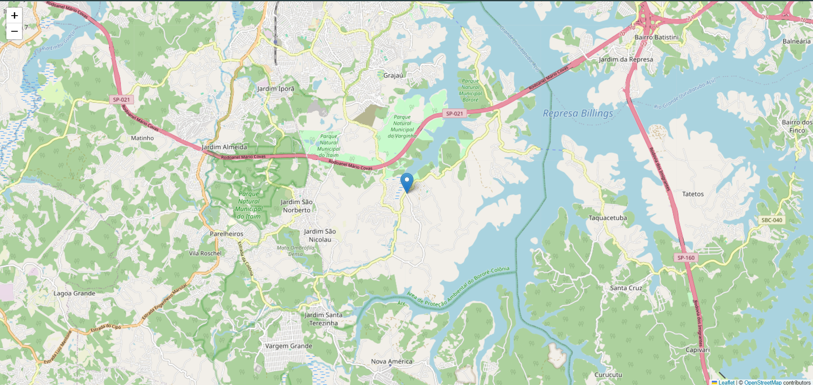

# Introdução

Nesta atividade o objetivo foi construir um sistema de monitoramento de uma linha de ônibus utilizando:

- Pontos de parada da linha  
- Posição em tempo real dos ônibus  
- API pública Olho Vivo (SPTrans)  
- Visualização geográfica com **Folium**  

O resultado final é um **mapa interativo**, contendo paradas (cor azul) e ônibus em movimento (vermelho).

---

# Obtenção do Token

Para acessar a API é necessário criar um cadastro e gerar um **token de autenticação**, fornecido pela SPTrans.

Esse token é utilizado em todas as requisições.

### Exemplo de autenticação:

```python
# Autenticação na API SPTrans
import requests

TOKEN = "SEU_TOKEN_AQUI"   # Substituir pelo token real
BASE = "http://api.olhovivo.sptrans.com.br/v2.1"

def autenticar():
    """Realiza autenticação obrigatória na API."""
    url = f"{BASE}/Login/Autenticar?token={TOKEN}"
    r = requests.post(url)
    return r.json()  # Retorna True/False
```

---

# Obtendo as Paradas da Linha

Com o token válido, podemos consultar os pontos de parada de uma linha:

```python
# Obtendo todas as paradas da linha informada
import requests

TOKEN = "SEU_TOKEN_AQUI"
linha = "1234"  # Exemplo de linha

url_paradas = (
    "https://api.olhovivo.sptrans.com.br/v2.1/parada/"
    f"BuscarParadasPorLinha?token={TOKEN}&codigoLinha={linha}"
)

res = requests.get(url_paradas)
paradas = res.json()
```

Cada parada contém:

- Latitude
- Longitude
- Denominacao

---

# Construindo o Mapa com Folium

```python

import folium

# Centro inicial do mapa (primeira parada)
lat0 = paradas[0]["Latitude"]
lon0 = paradas[0]["Longitude"]

mapa = folium.Map(location=[lat0, lon0], zoom_start=13)

# Adicionando marcadores das paradas (azul)
for p in paradas:
    folium.Marker(
        location=[p["Latitude"], p["Longitude"]],
        popup=p["Denominacao"],
        icon=folium.Icon(color="blue")
    ).add_to(mapa)
```

---

# Obtendo a Posição Atual dos Ônibus

```python
# Requisição de veículos em tempo real
url_pos = (
    "https://api.olhovivo.sptrans.com.br/v2.1/posicao?"
    f"token={TOKEN}&codigoLinha={linha}"
)

res = requests.get(url_pos)
dados = res.json()

onibus = dados.get("vs", [])  # Lista de veículos
```

Os veículos retornam:

- py → latitude
- px → longitude

---

# Adicionando Ônibus ao Mapa

```python
# Marcadores dos ônibus (vermelho)
for o in onibus:
    folium.Marker(
        location=[o["py"], o["px"]],
        popup="Ônibus em tempo real",
        icon=folium.Icon(color="red")
    ).add_to(mapa)

# Salvando o mapa
mapa.save("mapa_onibus.html")
```

---

# Resultado Final


{width=70% style="display: block; margin: 0 auto;"}

Conclusão
Nesta atividade foi desenvolvido um sistema completo para monitoramento de uma linha de ônibus da SPTrans, incluindo:

Consulta de paradas

Consulta de posição em tempo real dos ônibus

Integração com API pública

Exibição geográfica utilizando Folium

Construção de um mapa interativo

O trabalho demonstra o uso combinado de APIs, manipulação de dados e visualização em camadas.