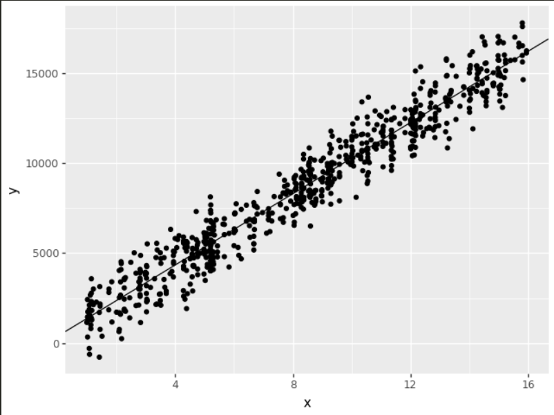

# Introdução

Nesta atividade devemos analisar a relação entre:

- **X:** anos de estudo  
- **y:** salário  

Os valores foram fornecidos em dois arquivos:

- `X.txt`  
- `y.txt`

A tarefa inclui:

1. Ler os dados  
2. Aplicar a **fórmula matricial da regressão linear**  
3. Calcular os coeficientes **a** (intercepto) e **b** (inclinação)  
4. Plotar os pontos + reta ajustada usando *plotnine*

---

# Fórmula Matricial

A regressão linear simples segue:

\[
\hat{y} = a + b x
\]

Com fórmula matricial:

\[
\beta = (X^T X)^{-1} X^T y
\]

Onde:

- `β[0] = a`  
- `β[1] = b`  

---

# Leitura dos Dados


```python

import numpy as np

X = np.loadtxt("X.txt")
y = np.loadtxt("y.txt")
Montagem da Matriz
python
Copiar código
# Criação da matriz com coluna de 1s
X_mat = np.column_stack((np.ones(len(X)), X))

# Fórmula matricial
beta = np.linalg.inv(X_mat.T @ X_mat) @ X_mat.T @ y

a, b = beta[0], beta[1]
Gerando Gráfico com a Reta
python
Copiar código
from plotnine import (
  ggplot, aes, geom_point, geom_abline
)
import pandas as pd

df = pd.DataFrame({"x": X, "y": y})

plot = (
  ggplot(df, aes("x", "y"))
  + geom_point()
  + geom_abline(intercept=a, slope=b)
)

plot.save("grafico_regressao.png")
```
Gráfico Gerado


Conclusão
Nesta atividade:

Li os dados X e y fornecidos

Apliquei a fórmula matricial da regressão linear

Calculei os coeficientes a e b

Modelei a relação entre anos de estudo e salário

Construí o gráfico da regressão usando plotnine

O resultado mostra claramente a tendência de aumento salarial conforme aumentam os anos de estudo.


